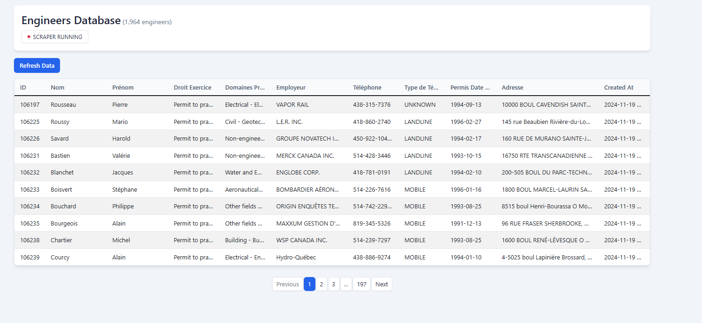

# Ordre Ingénieurs Québec Scraper

A Node.js application that scrapes engineer data from the Ordre des Ingénieurs du Québec (OIQ) directory and verifies phone numbers using Pages Jaunes. The application includes a web interface to view the collected data.

## Exported Data

The collected data is available in this [Google Spreadsheet](https://docs.google.com/spreadsheets/d/10QPSY3v7_QgLmrYr0Oz9T6dlB3dJf7jAbf3TFxs3XsQ/edit?gid=96276819#gid=96276819).


## Screenshots




## Features

- Scrapes engineer data from OIQ's member directory
- Verifies and categorizes phone numbers (mobile/landline) using Pages Jaunes
- Uses proxy rotation to handle concurrent requests
- Stores data in SQLite database
- Includes a web interface to view collected data
- Supports resumable scraping sessions
- Implements adaptive scanning modes (full/light) for efficiency

## Prerequisites

- Node.js (v14 or higher)
- npm
- A Geonode proxy subscription (for proxy rotation)

## Installation

1. Clone the repository:
```bash
git clone https://github.com/yourusername/ordre-ingenieurs-quebec-scraper.git
cd ordre-ingenieurs-quebec-scraper
```

2. Install dependencies:
```bash
npm install
```

3. Create a `.env` file in the root directory with your proxy credentials:
```env
PROXY_USERNAME=your_geonode_username
PROXY_PASSWORD=your_geonode_password
PORT=3000  # Optional, defaults to 3000
```

## Project Structure

```
ordre-ingenieurs-quebec-scraper/
├── data/                  # SQLite database storage
├── public/               # Web interface files
├── fetch_engineers.js    # Main scraping logic
├── main.js              # Express server and API
└── .env                 # Environment variables
```

## Usage

1. Start the application:
```bash
node main.js
```

2. The application will:
   - Start a web server (accessible at http://localhost:3000)
   - Begin scraping engineer data
   - Store results in a SQLite database

3. Access the web interface to view collected data:
   - Local: http://localhost:3000
   - Network: http://{your-ip}:3000

## Scraping Process

The scraper checks three ranges of engineer IDs:
- Primary: 100,000 - 149,999 (50,000 IDs)
- Early: 20,000 - 49,999 (30,000 IDs)
- Modern: 5,000,000 - 5,068,000 (68,000 IDs)

For each valid engineer found:
1. Collects basic information from OIQ
2. Verifies phone numbers through Pages Jaunes
3. Categorizes phone numbers as mobile/landline
4. Stores results in SQLite database

### Performance Features

- Concurrent requests (15 simultaneous by default)
- Proxy rotation to avoid rate limiting
- Adaptive scanning modes:
  - Full mode: Checks every ID
  - Light mode: Checks every 10th ID when many invalid IDs are found
- Resumable sessions: Continues from last processed ID if interrupted

## API Endpoints

### GET /api/data
Returns paginated engineer data:
- Query parameters:
  - `page`: Page number (default: 1)
  - `limit`: Records per page (default: 10)
- Returns JSON with:
  - Engineer data
  - Pagination information
  - Total record count

## Error Handling

- Automatic retry on failed requests (max 3 attempts)
- Proxy rotation on connection errors
- Detailed error logging
- Database transaction safety


## Disclaimer

This tool is for educational purposes only. Ensure you comply with OIQ's and Pages Jaunes' terms of service and robots.txt policies when using this scraper.
